# Как принимать выплаты с Polar в Казахстан на счёт ИП: полный пошаговый гайд

[](LICENSE)
[](https://github.com/sultanlive/polar-kazakhstan-guide)
[](https://polar.sh)

> **Практическое пошаговое руководство для разработчиков, фаундеров и создателей цифровых продуктов из Казахстана.**  
> Реальный проверенный кейс вывода валютной выручки через **[Polar.sh](https://polar.sh)** (Merchant of Record / Stripe Connect Express) на тенговый счёт ИП во **Freedom Bank**: от нажатия кнопки «Withdraw» до прохождения валютного контроля и автоматического зачисления денег на карту.

---

## 📌 Оглавление
1. [Почему Polar и в чём главная сложность для Казахстана](#1-почему-polar-и-в-чём-главная-сложность-для-казахстана)
2. [Этап 1. Настройка выплаты в Polar и Stripe Connect](#этап-1-настройка-выплаты-в-polar-и-stripe-connect)
3. [⚠️ Ловушка №1: Где взять инвойс, пока статус «In Transit»?](#️-ловушка-1-где-взять-инвойс-пока-статус-in-transit)
4. [Этап 2. Генерация Reverse Billing Invoice в Polar](#этап-2-генерация-reverse-billing-invoice-в-polar)
5. [Этап 3. Перевод инвойса на русский язык с заверением](#этап-3-перевод-инвойса-на-русский-язык-с-заверением)
6. [Этап 4. Регистрация валютного договора во Freedom Bank](#этап-4-регистрация-валютного-договора-во-freedom-bank)
7. [Этап 5. Поступление денег: как работает межбанк и автоматическое зачисление](#этап-5-поступление-денег-как-работает-межбанк-и-автоматическое-зачисление)
8. [Этап 6. Налоги и вывод прибыли: частые вопросы](#этап-6-налоги-и-вывод-прибыли-частые-вопросы)
9. [Итоговый чек-лист для фаундера](#итоговый-чек-лист-для-фаундера)

---

## 1. Почему Polar и в чём главная сложность для Казахстана

Если вы создаёте SaaS, продаёте софт, цифровые подписки или монетизируете Open Source, стандартный Stripe в Казахстане официально недоступен.

Платформа **[Polar.sh](https://polar.sh)** решает эту проблему, выступая в роли **Merchant of Record (MoR)**:
* Polar берет на себя приём оплат со всего мира, выставление чеков клиентам и уплату международных налогов с продаж (VAT/Sales Tax в США, ЕС и других странах).
* Вы юридически продаёте свой продукт компании **Polar Software, Inc.**, а она выплачивает вам вознаграждение через шлюз **Stripe Connect Express**.
* **Главный плюс:** Stripe Connect Express позволяет привязать банковский счёт **ИП из Казахстана** (IBAN в формате `KZ...`).

Однако на этапе получения денег в Казахстане любой предприниматель сталкивается с **валютным контролем Национального Банка РК**: регистрацией валютных договоров, переводами инвойсов и налоговой отчётностью.

Ниже — пошаговый алгоритм, как пройти этот путь быстро, законно и с первого раза.

---

## Этап 1. Настройка выплаты в Polar и Stripe Connect

### 1.1. В какой валюте открывать счёт?
В казахстанский банк выплата от Stripe Connect Express в настоящее время приходит **только в тенге (KZT)**: Stripe автоматически конвертирует доллары в тенге по своему курсу в момент расчёта выплаты.
* Привязывайте в Stripe Express **текущий счёт вашего ИП в KZT** (`IBAN KZ...8KZT`).

### 1.2. Что происходит после нажатия кнопки «Withdraw»?
Когда вы нажимаете кнопку вывода баланса в Polar:
1. **Деньги переводятся в Stripe Express:** В личном кабинете Stripe появляется операция со статусом `Payment Succeeded` (например, $1 465,73 сконвертированы в 672 908,85 KZT).
2. **Формируется банковский Payout:** В Stripe создаётся отдельная транзакция `Payout` со статусом `In Transit` (в пути). Stripe указывает ориентировочную дату поступления (обычно 2–3 рабочих дня).
3. **Статус в Polar:** На время движения средств в кабинете Polar выплата отображается в статусе `In Transit`.

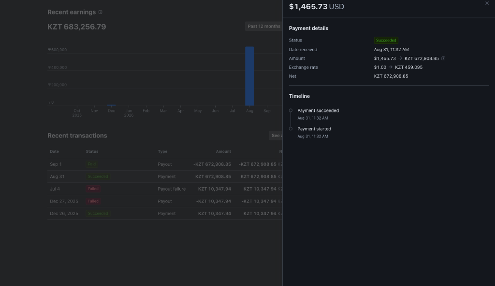

```
[ Баланс Polar ($) ] 
       │
       ▼ (Withdraw)
[ Stripe Express: Payment Succeeded ($1,465.73 → 672,908.85 ₸) ]
       │
       ▼ (3 рабочих дня: трансграничный клиринг)
[ JPMorgan Chase (США) → Citibank Europe → АО «Ситибанк Казахстан» ]
       │
       ▼
[ Freedom Bank: автоматическое зачисление на счёт ИП ]
```

---

## ⚠️ Ловушка №1: Где взять инвойс, пока статус «In Transit»?

Это частый повод для паники у новичков: банк уже может спросить основание перевода, вы заходите в `Polar → Finance → Payouts → ⋮`, а там доступна только кнопка **«Download CSV»**, кнопки инвойса нет!

* **Причина:** В исходном коде веб-интерфейса Polar генерация инвойса заблокирована до момента, пока выплата не получит финальный статус **`Succeeded`**.
* **Решение:** Не нужно паниковать и писать в поддержку. Просто дождитесь дня, указанного в Stripe как расчетная дата прибытия (Estimated arrival). Как только Stripe отметит выплату как `Paid/Completed`, в Polar статус сменится на `Succeeded`, и откроется форма **Generate Invoice**.

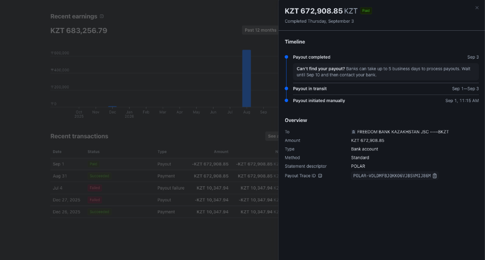

---

## Этап 2. Генерация Reverse Billing Invoice в Polar

Как только статус стал зелёным (`Succeeded`), нажмите `⋮` напротив выплаты и выберите **Generate Invoice**.

> ⚠️ **Критически важно:** Инвойс генерируется один раз и фиксируется в финансовой базе Polar. Отредактировать его через интерфейс задним числом нельзя!

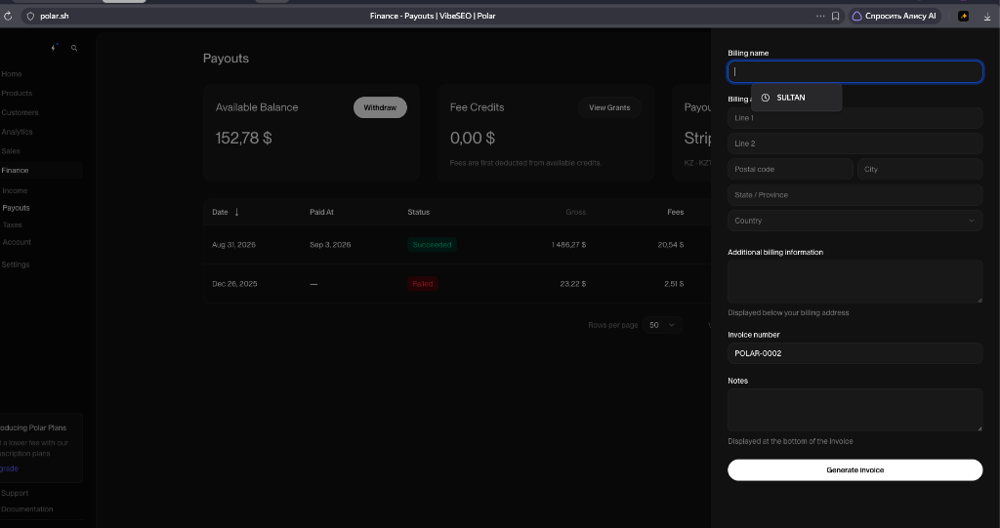

### Как правильно заполнить поля для банка РК:

1. **Billing name:** Официальное наименование вашего ИП (например, `IP SULTAN [ФАМИЛИЯ]` или `ИП СИГМА`).
2. **Billing address:** Адрес регистрации вашего ИП по талону (улица, дом, город, индекс, страна — `Kazakhstan`).
3. **Additional billing information (Самое важное поле!):**  
   Обязательно укажите налоговые и банковские реквизиты ИП, чтобы валютный контроль моментально связал инвойс с вашим банковским счётом:
   ```text
   IIN: [Ваш 12-значный ИИН]
   Beneficiary Bank: JSC "Bank Freedom Finance Kazakhstan"
   Bank SWIFT / BIC: FFINKZ2A
   Account (IBAN): [Ваш полный KZ... счёт в тенге]
   Currency: KZT
   ```
4. **Invoice number:** Оставьте сгенерированный системой (например, `POLAR-0002`).
5. **Notes:** Добавьте пояснение с трек-номером из Stripe:
   ```text
   Payout for digital products resold by Polar.sh under Polar Master Services Terms.
   Processed via Stripe Connect.
   Stripe Payout Trace ID: [Код отслеживания из Stripe Express]
   Payout Amount: [Сумма в KZT]
   ```

Нажмите **Generate Invoice** и скачайте полученный PDF-файл.

---

## Этап 3. Перевод инвойса на русский язык с заверением

По валютному законодательству Республики Казахстан все подтверждающие документы, составленные на иностранном языке, должны сопровождаться **переводом на русский или казахский язык**.

> 💡 **Нотариальный перевод НЕ требуется!** Закон позволяет предпринимателю заверить перевод самостоятельно:  
> *«Перевод верен. Индивидуальный предприниматель [ФИО], подпись, дата»*.

### Структура документа перевода:
Перевод оформляется идентично оригинальному инвойсу Polar:
1. **Шапка:** Обратный инвойс (Reverse Invoice), номер, дата, ID выплаты, способ выплаты (Stripe Connect Express).
2. **Исполнитель / Получатель:** ИП, ИИН, адрес, банк (АО «Банк Фридом Финанс Казахстан»), БИК `FFINKZ2A`, IBAN.
3. **Заказчик:** Polar Software, Inc., 548 Market St, PMB 61301, San Francisco, CA 94104, United States.
4. **Таблица расчёта:**
   * Продажи цифровых услуг за период ($1,601.70)
   * Доля платформы Polar (-$115.43)
   * Комиссия за выплату (-$20.54)
   * Итого к выплате: **$1,465.73 USD**
   * Сумма к зачислению в банк: **672,908.85 KZT**
5. **Официальный блок заверения внизу страницы:**
   ```text
   ОТМЕТКА О ЗАВЕРЕНИИ ПЕРЕВОДА:
   Настоящим подтверждаю, что перевод с английского языка на русский язык верен 
   и полностью соответствует оригинальному документу Reverse Invoice № POLAR-0002.

   Исполнитель: Индивидуальный предприниматель «СИГМА»
   ИИН: 970710350700
   Дата: «03» сентября 2026 г.
   Подпись: _______________ / (М.П. при наличии)
   ```

### ⚡ Лайфхак: Как подписать документ за 10 секунд на Mac без принтера
1. Откройте PDF-перевод в стандартной программе **Просмотр (Preview)** на macOS.
2. На панели инструментов нажмите значок **«Разметка»** (круг с маркером) → выберите **«Подпись»** ✍️.
3. Распишитесь на трекпаде или покажите подпись на белом листе в веб-камеру — Mac создаст идеальный векторный росчерк.
4. Перетащите подпись на строку «Подпись» и сохраните (`Cmd + S`). Банк принимает такой электронный скан без единого вопроса!

---

## Этап 4. Регистрация валютного договора во Freedom Bank

> ⚠️ **КРИТИЧЕСКИ ВАЖНО: Заранее пополните счёт ИП на 1 500 – 2 000 ₸!**  
> Регистрация валютного договора во Freedom Bank — платная услуга (комиссия банка составляет **1 000 ₸**).  
> Если на вашем счёте будет 0 ₸, банк не сможет списать комиссию, и валютный контроль отклонит заявку с возвратом на доработку. Перед подачей заявки закиньте на тенговый счёт ИП хотя бы 1 500 – 2 000 ₸ через Kaspi или Freedom SuperApp.

Зайдите в интернет-банк для юридических лиц [online.bankffin.kz](https://online.bankffin.kz) с компьютера.

Перейдите: **«Валютные операции» → «Регистрация валютного контракта»** (кнопка `+Регистрация контракта`).

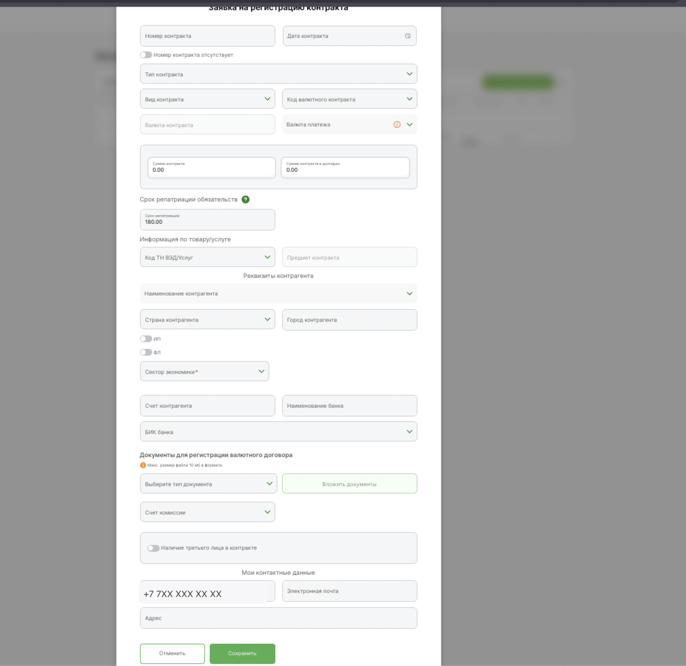

### Шаг 4.1. Основные реквизиты контракта:
* **Номер контракта:** Номер инвойса (например, `POLAR-0002`).
* **Дата контракта:** Дата выставления инвойса.
* **Тип контракта:** Выбирайте 👉 **`Контракт без присвоения УН (контракты до 50000 долларов США товары/услуги)`**.  
  *(Если сумма сделки меньше $50 000 в эквиваленте, учётный номер контракта в Нацбанке получать не требуется — регистрация проходит по упрощённой схеме).*
* **Вид контракта:** **Экспорт** *(вы продаёте софт нерезиденту)*.
* **Код валютного контракта:** **Услуги**.
* **Валюта контракта и платежа:** `USD`.
* **Сумма контракта:** Сумма инвойса (например, `1465.73`).
* **Срок репатриации обязательств:** Оставьте значение по умолчанию (`180.00` дней).
* **Код ТН ВЭД / Услуг:** Выберите категорию IT: **«Компьютерные услуги»** или **«Услуги в области информационных технологий»**.
* **Предмет контракта:** `Предоставление программного обеспечения и цифровых услуг (Digital services and products resold by Polar.sh)`.

### Шаг 4.2. Реквизиты контрагента (Polar):
* **Наименование контрагента:** `Polar Software, Inc.`
* **Страна контрагента:** `Соединенные Штаты Америки (США)`
* **Город контрагента:** `San Francisco`
* **Тумблеры ИП и ФЛ:** Оставить выключенными (Polar — юридическое лицо / корпорация).
* **Сектор экономики:** 👉 **`7: Негосударственные нефинансовые организации`** *(стандартный код для коммерческих частных IT-компаний по классификатору Нацбанка РК)*.

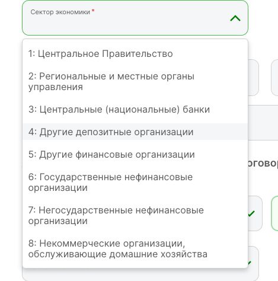

* **Счет контрагента:** Укажите `NONE` (так как при экспорте расчётный счёт плательщика в инвойсе не фигурирует).
* **БИК банка:** Введите SWIFT банка системы Stripe в США — 👉 **`CHASUS33`** *(JPMorgan Chase Bank, N.A.)* и выберите подразделение из списка (например, `CORE CASH MANAGEMENT - CHASUS33DIS`). Наименование банка заполнится автоматически.

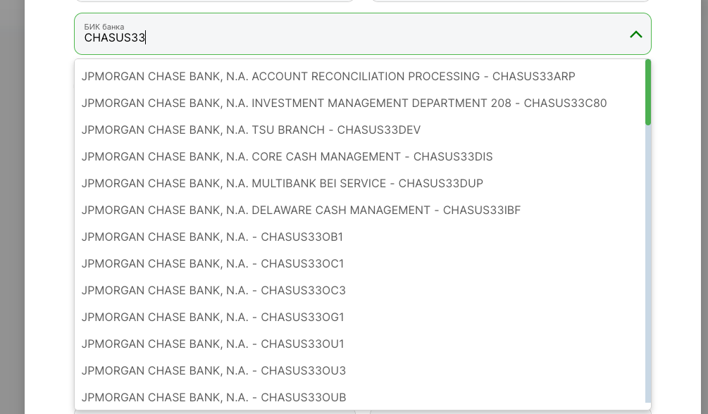

### Шаг 4.3. Прикрепление файлов:
В блоке «Документы для регистрации валютного договора»:
1. Выберите тип документа: **`Валютный договор (Вкладываются только Договоры, Контракты, инвойсы (в случае регистрации данного инвойса))`**.

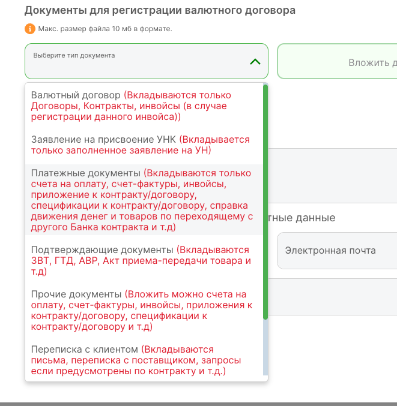

2. Нажмите **«Вложить документы»** и прикрепите **два файла**:
   * Английский оригинал: `POLAR-0002.pdf`
   * Заверенный перевод с подписью: `Payout-POLAR-0002-03-ru.pdf`
3. **Счёт комиссии:** Выберите ваш текущий тенговый счёт ИП (на нём должно быть минимум 1 000 ₸).

### Шаг 4.4. Дополнительные сведения:
На втором шаге откроется окно «Информация по валютному контракту»:
* **Заказчик работ/услуг:** Включите тумблер *«Подтверждаю, что контрагент является Заказчиком»* (`Polar Software, Inc.`, США).
* **Конечный услугополучатель:** Включите тумблер *«Подтверждаю, что контрагент является Конечным услугополучателем»*.
* **Поставщик услуг:** Включите тумблер **`ИП`** (не ФЛ!) и подтвердите, что вы являетесь поставщиком (`ИП Сигма`, Казахстан).
* **Инкотермс:** Оставьте поле пустым (Инкотермс касается только физических грузов, для услуг не применяется).

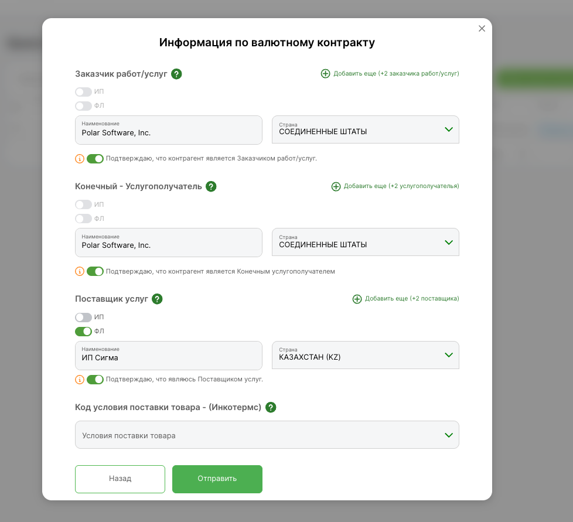

Нажмите **«Отправить»** и подпишите заявку вашей **ЭЦП (ГОСТ)** через NCALayer.

Статус заявки перейдёт в `В процессе`, а затем сменится на заветное **`Выполнено`**! 🟢 Банк спишет 1 000 ₸ комиссии за регистрацию.

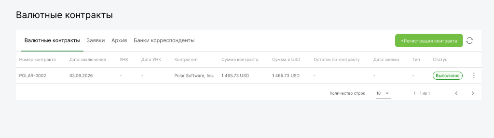

---

## Этап 5. Поступление денег: как работает межбанк и автоматическое зачисление

### 5.1. Реальные сроки движения средств
Хотя календарно между отправкой и зачислением может пройти 4–5 дней, межбанковская система считает **исключительно рабочие банковские дни (Business Days)**:
* **Четверг (3 сентября):** Stripe выпустил выплату (`Payout Completed`).
* **Пятница (4 сентября):** День 1 движения в международном клиринге.
* **Суббота – Воскресенье:** Выходные дни (международный SWIFT отдыхает).
* **Понедельник (7 сентября):** День 2 обработки банками-корреспондентами.
* **Вторник (8 сентября, 11:20 утра):** **День 3 — деньги успешно поступили в банк!**

### 5.2. Как устроен маршрут под капотом (Выписка банка)
Посмотрим на реальную выписку из Freedom Bank:

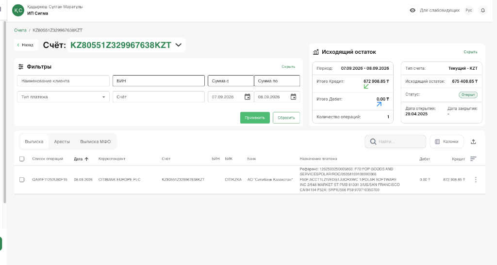

Маршрут движения средств выглядел так:
1. **Отправитель:** `POLAR SOFTWARE INC, 548 MARKET ST PMB 61301 SAN FRANCISCO CA/94104 US` (через JPMorgan Chase Bank).
2. **Международный клиринговый шлюз:** `CITIBANK EUROPE PLC`.
3. **Казахстанский банк-корреспондент:** `АО "Ситибанк Казахстан"` (БИК `CITIKZKA`).
4. **Банк получателя:** АО «Банк Фридом Финанс Казахстан» (`FFINKZ2A`).
5. **Назначение платежа:** `POP GOODS AND SERVICES POLAR ... ИИН 970710350700`.

### 5.3. Почему деньги зачислились АВТОМАТИЧЕСКИ (без заявлений на транзитный счёт)?

Многие ожидают, что придётся заходить во вкладку *«Входящие международные платежи»* и подписывать заявление на зачисление. Однако эта вкладка осталась абсолютно пустой!

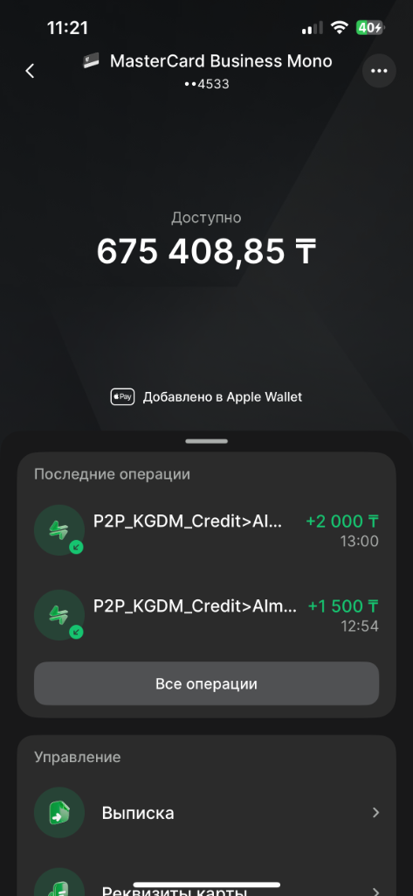

**Секрет простой:**
* Вкладка «Входящие международные платежи» предназначена **только для иностранной валюты (USD, EUR)**, когда деньги падают на транзитный валютный счёт.
* Stripe присылает деньги в **тенге (KZT)** через казахстанский клиринг Ситибанка.
* Поскольку валютный контракт `POLAR-0002` **уже был заранее зарегистрирован** в базе Freedom Bank, автоматический робот комплаенса сопоставил входящий платёж с контрактом за 1 секунду и **сразу зачислил всю сумму напрямую на текущий счёт и бизнес-карту!**

Менеджер банка подтвердила:  
> *«Сумма уже у вас на текущем счету, никаких заявлений заполнять не нужно».*

---

## Этап 6. Налоги и вывод прибыли: частые вопросы

### 1. Нужно ли делать валютный контракт, раз деньги приходят в тенге (KZT)?
👉 **ДА, ОБЯЗАТЕЛЬНО!**  
Это самое частое заблуждение. По Закону РК *«О валютном регулировании и валютном контроле»* (ст. 1, п. 5) к **валютным операциям** относятся любые расчёты между резидентом Казахстана и нерезидентом, **в том числе в национальной валюте (ТЕНГЕ)**.  
Плательщиком является американская корпорация `Polar Software, Inc.`. Если вы не зарегистрируете контракт заранее, входящий платёж зависнет как невыясненный, и банк через несколько дней вернёт его обратно в США!

### 2. Как перевести деньги с Freedom Business на личную карту (Kaspi / Freedom SuperApp)?
Перевод со счёта ИП на личную карту физлица делается в 1 клик через раздел переводов:
* **Назначение платежа:** *«Перевод собственных средств / чистого дохода ИП на личный счет. Без НДС»*.
* **КНП (Код назначения платежа):** `343` (или стандартный перевод себе на карту).

### 3. Нужно ли платить налог с этого перевода?
**НЕТ (0%).**  
ИП в Казахстане — это физическое лицо. Доход облагается налогом **один раз** при получении выручки от Polar. Перевод остатка на личную карту — это не новая продажа и не дивиденды, повторного налога здесь нет.

### 4. Можно ли переводить через «Зарплатный проект»?
❌ **Категорически НЕТ!**  
ИП не имеет права нанимать сам себя и платить себе зарплату. Если вы прогоните деньги через зарплатный проект, банк и налоговая начислят налоги как на наёмного работника (ИПН 10%, ОПВ 10%, СО, ВОСМС), и вы заплатите налоги дважды.

### 5. Можно ли привязать бизнес-карту к Apple Pay и оплачивать всё подряд?
* **Для бизнеса (серверы, софт, OpenAI, Cursor, хостинг, реклама, рабочий ноутбук):**  
  ✅ **ДА**, это прямые расходы бизнеса, оплачивайте бизнес-картой.
* **Для личной жизни (продукты, кафе, одежда, личные рассрочки в Kaspi):**  
  ⚠️ **Не рекомендуется.**  
  Не смешивайте личные чеки с предпринимательской выпиской. Выведите чистый доход на Kaspi Gold или Freedom SuperApp и спокойно оплачивайте повседневные расходы оттуда.

### 6. Сколько отложить на налоги?
Если ваше ИП работает по **упрощённой декларации (форма 910)**:
* **4%** от суммы дохода (по ставке розничного налога или упрощёнки с учётом местных льгот);
* Обязательные социальные платежи за себя за месяц получения дохода: ОПВ (пенсионные), СО (соцотчисления), ВОСМС (медстраховка), ОПВР. Для минимальной зарплаты это суммарно около 15 000 – 20 000 ₸ в месяц.

---

## Итоговый чек-лист для фаундера

| Шаг | Где делать | Действие |
| :--- | :--- | :--- |
| **1. Вывод** | Polar.sh | Нажать Withdraw, указать KZT IBAN ИП в Stripe Express |
| **2. Ожидание** | Polar / Stripe | Дождаться статуса `Succeeded` (расчётная дата) |
| **3. Инвойс** | Polar.sh | Заполнить форму: указать ИИН, IBAN и банк в `Additional info`. Скачать PDF |
| **4. Перевод** | Локально | Составить перевод на русский, заверить надписью «Перевод верен», подписать в Preview на Mac |
| **5. Пополнение** | Банк | Закинуть на счёт ИП **1 500 – 2 000 ₸** на комиссию банка (1 000 ₸) |
| **6. Контракт** | Freedom Bank | Зарегистрировать контракт без УНК (< $50k), сектор 7, БИК `CHASUS33`. Прикрепить 2 файла. Подписать ЭЦП |
| **7. Зачисление** | Автоматически | Деньги приходят через 2–3 рабочих дня и **автоматически падают сразу на текущий счёт и карту!** |
| **8. Прибыль** | Freedom Bank | Отложить ~4% на налог, остаток перевести на личную карту с КНП 343 |

---

## License
MIT License. Свободно для распространения и использования предпринимателями из Казахстана.
